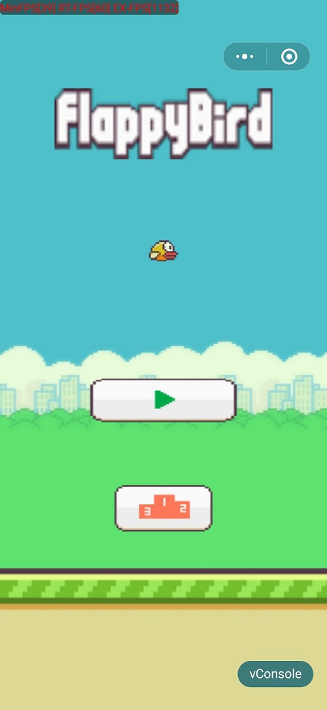
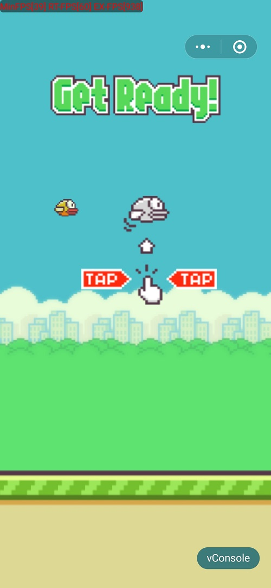
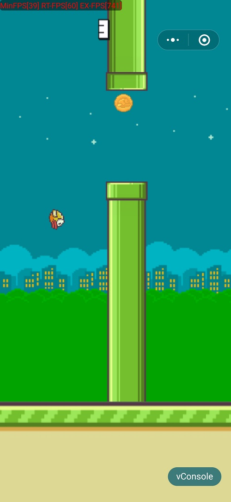
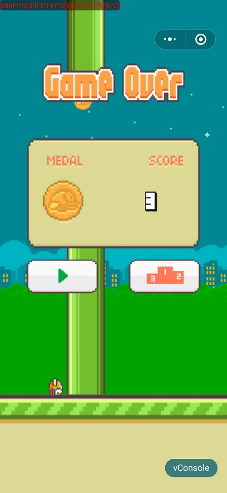
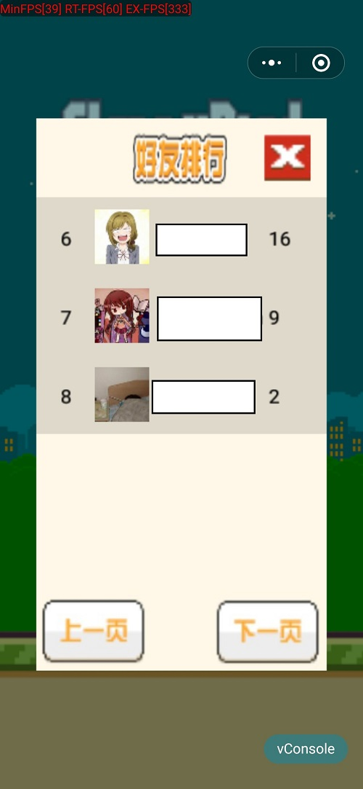

# Wechat Mini Game Flappy-Bird


[](https://github.com/Joke-Lin/Flappy-Bird/archive/master.zip)

## 项目概述

> 基于微信实现的经典小游戏 **Flappy-Bird**
>
> 这是一款简单又困难的手机游戏，游戏中玩家必须控制一只胖乎乎的小鸟，跨越由各种不同长度水管所组成的障碍。上手容易，但是想通关可不简单。Flappy bird 于2013年5月在苹果App Store上线，2014年2月份在100多个国家/地区的榜单一跃登顶，尽管没有精细的动画效果，没有有趣的游戏规则，没有众多的关卡，却突然大火了一把，下载量突破5000万次。
>
> 本项目只是在微信端重写此游戏

**此项目逻辑设计，代码编写均独立完成**

### MIT License

Copyright (c) 2019 Lin Weijun

Permission is hereby granted, free of charge, to any person obtaining a copy
of this software and associated documentation files (the "Software"), to deal
in the Software without restriction, including without limitation the rights
to use, copy, modify, merge, publish, distribute, sublicense, and/or sell
copies of the Software, and to permit persons to whom the Software is
furnished to do so, subject to the following conditions:

The above copyright notice and this permission notice shall be included in all
copies or substantial portions of the Software.

THE SOFTWARE IS PROVIDED "AS IS", WITHOUT WARRANTY OF ANY KIND, EXPRESS OR
IMPLIED, INCLUDING BUT NOT LIMITED TO THE WARRANTIES OF MERCHANTABILITY,
FITNESS FOR A PARTICULAR PURPOSE AND NONINFRINGEMENT. IN NO EVENT SHALL THE
AUTHORS OR COPYRIGHT HOLDERS BE LIABLE FOR ANY CLAIM, DAMAGES OR OTHER
LIABILITY, WHETHER IN AN ACTION OF CONTRACT, TORT OR OTHERWISE, ARISING FROM,
OUT OF OR IN CONNECTION WITH THE SOFTWARE OR THE USE OR OTHER DEALINGS IN THE
SOFTWARE.

### 项目结构

```
│  content.txt              # 项目目录总览
│  game.js                  # 项目入后点
│  game.json                # 小游戏配置
│  LICENSE                  # 开源协议 MIT
│  project.config.json      # 项目配置
│  README.md
│  
├─js
│  │  global.js             # 游戏全局布局 以及 全局数据区
│  │  instance.js           # 游戏中所有需要的类示例 以及 贯穿游戏的动画设置
│  │  
│  ├─Element                # 游戏元素类
│  │      background.js
│  │      bird.js
│  │      button.js
│  │      ground.js
│  │      pipe.js
│  │      scoreboard.js
│  │
│  ├─Page                   # 游戏页面类 开始界面以及运行时界面
│  │      gamePlayPage.js
│  │      startPage.js
│  │
│  └─Tool                   # 辅助函数
│          tool.js
│
├─myOpenDataContext         # 关系链数据域（排行榜配置）
│  │  index.js
│  │  
│  └─src                    # 排行榜资源
│          close.jpg
│          lastPage.jpg
│          nextPage.jpg
│          title.jpg
│
├─out                       # 代码行数统计
│      linecount.json
│      linecount.txt
│
└─src                       # 游戏资源文件
    ├─Audio                 # 音频资源
    │      bgm.mp3
    │      hit.mp3
    │      point.mp3
    │      wing.mp3
    │
    └─Image                 # 图片资源
        │  
        └─Font              # 字体图片
                font_0.png
                font_1.png
                font_2.png
                font_3.png
                font_4.png
                font_5.png
                font_6.png
                font_7.png
                font_8.png
                font_9.png
```

### 项目行数统计

> 具体信息在 out目录中

```
===============================================================================
EXTENSION NAME : linecount
EXTENSION VERSION : 0.1.7
-------------------------------------------------------------------------------
count time : 2019-06-13 15:27:34
total files : 58
total code lines : 1481
total comment lines : 373
total blank lines : 198
```

## 类概述

### 背景类

```
@Name: Background
@Attrributes:
    constructor
    drawToCanvas
    setAnimation：设置昼夜转换动画
    changeType
@Description:
    显示游戏背景提供昼夜交替效果
```

### 小鸟类

```
@Name: Bird
@Attributes:
    constructor：构造函数
    reStart：重新设置参数 重开游戏使用到
    drawToCanvas：绘图
    setAnimation：设置小鸟精灵图切换
    changeStateOfSpirit：上面函数调用
    setAnimationUpDown：开始界面的上下移动动画
    changeStateOfUpDown：上下移动
    clearUpDownAnimation：删除上下移动动画
    jump：跳越 设置向上的初速度
    setDownAnimation：设置向下移动动画
    moveDown：向下移动
    clearDownAnimation：删除向下移动动画
@Decription:
    提供小鸟的有关操作动画
```

### 按钮类

```
@Name: Button
@Attributes:
    constructor：构造函数
    isClicked: 判断是否点击到
    drawToCanvas：绘图
@Decription:
    按钮的基础操作 许多图片展示也可以使用按钮类
```

### 地面元素类

```
@Name: SingleGround
@Attributes:
    constructor：构造函数
    drawToCanvas：绘图
    move: 地面移动
@Decription:
    地面单片移动 地面由许多的单片地面组成
```

### 管道类

```
@Name: Pipe
@Attributes:
    constructor：构造函数
    reSetHeight: 重新设置参数
    drawToCanvas：绘图
    move：移动 长度和地面相同
@Decription:
    一对管道的基础操作实现 构造函数需提供横坐标
```

### 分数板类

```
@Name: ScoreBoard
@Attributes:
    constructor：构造函数
    drawToCanvas：绘图
@Decription:
    分数板的绘制
```

### 游戏初始页面类

```
@Name: GamePlayPage
@Attributes:
    constructor：构造函数
    reStart：重新设置参数
    touchEventMonitor：监听点击事件
    dealTouochEvent：处理点击事件
    quitTutorial：tutorial图片的淡出
    setEnterAnimation：设置进场动画
    enterAnimation：进场动画
    drawGameReady：绘制初始元素（GameReady tutorial）
    loop：循环渲染
@Decription:
    正式的游戏开始界面 游戏核心
```

### 开始游戏页面类

```
@Name: StartPage
@Attributes:
    constructor：构造函数
    touchEventMonitor：监听页面点击事件
    dealTouochEvent：处理点击事件
    removeTouchMonitor：删除点击事件
    setQuitAnimation：设置退场动画 淡出
    quitAnimation：上面函数调用
    loop：循环渲染
@Decription:
    开始界面渲染 事件处理
```

### tool.js (辅助函数)

```
文本绘制函数:drawTextToCanvas
@Args:
    text: string to draw
    width: the one char's width
    height: the one char's height
    type: whcih style to choose
```

### global.js (全局配置)

```
@Attributes:
    canvas: 画布
    openDataContext: 子域绘图上下文
    sharedCanvas：子域画布
    Global: 游戏布局 资源路径 游戏状态保存
    Img：图片资源
    Music：音效资源
@Decription:
    整个游戏过程的游戏资源配置 所有元素的布局设置区 游戏状态保存（开始，运行，结束）
```

### instance.js (全局类实例)

```
@Attributes:
    createGround：生成地面
    Instance：游戏实例
    collisionPipe：判断小鸟与管道的碰撞
    produceMedal：生成奖牌
    collisionMedal：判断是否吃到奖牌
    medalMove：道具移动
    setInvincibleTimer：无敌状态定时器
    setInvincibleAndSeppdUpTimer：无敌 + 冲刺
    collisionMedals：判断和三种道具相撞
    collision：总的碰撞
    groundTimer：地面移动 管道移动 道具生成 逻辑判断

@Decription:
    整个游戏的实例库 以及 开始游戏的运行定时器 道具机制逻辑
```

## 游戏逻辑实现简介

> 游戏中除主循环外，动画效果均由定时器实现

### 游戏开始

开始处于游戏开始界面，绘制开始界面，基础动画设置，相应事件配置

随时捕捉用户触摸事件，用户触摸开始按钮后进入游戏运行界面，触摸排行榜后打开排行榜

界面之间切换均设置淡入淡出效果以实现平滑切换

### 游戏运行

重绘场景，

**Flappy-Bird** 中游戏先暂停在游戏运行初始界面，第一次点击后正式开始进入游戏（给用户提供一个缓冲，提升玩家体验）

运行时，玩家点击后小鸟跳跃一段距离，每隔特定时间产生一个新的管道，并不断进行碰撞检测，小鸟通过管道（其实是管道穿过小鸟）后分数增加，撞到之后游戏结束，进入游戏结束逻辑

在游戏中，为增加游戏趣味性，增加三个道具，小鸟碰撞到金银铜三块奖牌之后触发相应效果

### 游戏结束

在游戏结束逻辑，清除之前的事件监听，监听新的点击事件，点击游戏开始则重新开始游戏，点击排行榜则打开排行榜

### 小鸟逻辑

小鸟动画由一个定时器实现，小鸟由三帧动画，随时间不断切换，游戏运行时小鸟初速度为0，并有一个向下的加速度，小鸟不断下落，并且有一定旋转以显得自然，点击后给小鸟一个向上的初速度，并且角度设置为斜向右上。

此处小鸟碰撞简单的看作水平矩形碰撞，没有考虑小鸟图片的留白以及旋转后的位置变化

### 管道逻辑

管道由一对管道图片组成，游戏中只有两对管道，在前一个管道经过特定位置之后，将另一个管道位置重设为界面最右边并且重新设置两个小管道之间的位置，管道和地面速度一致（以显示小鸟的向前运动）

### 道具逻辑

游戏有三个道具，每隔特定管道数之后随机产生一个奖牌，奖牌概率不同，金牌概率最小，铜牌最高（概率由随机数设置，产生一个0-9的随机数，在(5,9]范围内生成铜牌），道具的位置随管道改变而改变，道具高度随机设置，设置在管道之间

### 地面逻辑

地面随时间不停向左移动，地面由一组小的地面元素组成，这组地面元素移动时需要注意边界问题，比如移动到最左边时候，不断在左边移出同时在右边移入

### 分数板

分数板显示用户分数，根据分数显示不同的奖牌

### 排行榜

排行榜由微信提供的关系链数据（主域和子域）设置，游戏结束时 通过`wx.setUserCloudStorage()`更新玩家分数，只保留玩家最高的分数

通过 `wx.getFriendCloudStorage()`获取好友数据，获取数据后绘制排行榜，排行榜每页显示5个好友，设置上一页，下一页功能

### Else

游戏所有状态切换都由`global.js`文件中的游戏状态保存设置

## 游戏效果图

### 开始



### 运行




### 结束



### 排行榜

